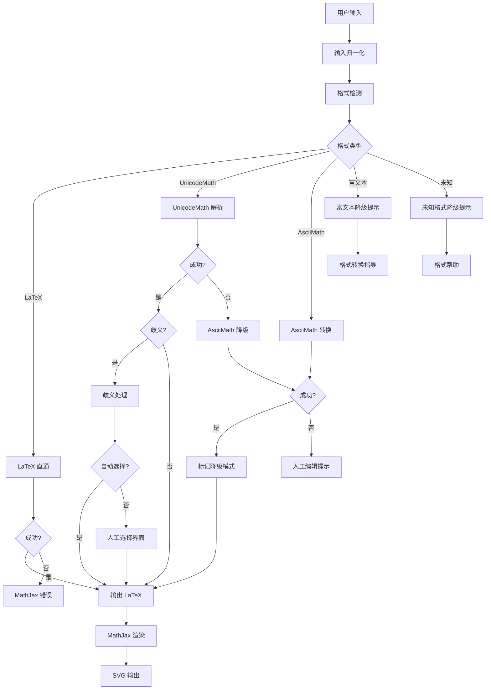

# 降级链规则文档

**版本**: 1.0.0  
**日期**: 2026-02-02  
**作者**: Math Formula Plugin Team

---

## 概述

本文档定义了数学公式插件的完整降级链（Fallback Chain），确保在各种输入场景下都能提供最佳的用户体验。降级链是一个多层次的容错机制，当主要解析路径失败时，系统会自动尝试备选方案，直到找到可行的解决方案或提供明确的用户指导。

---

## 降级链架构

### 完整降级链

```
用户输入
    ↓
┌─────────────────────────────────────────────────────────────┐
│ 1. 输入归一化 (PasteNormalizer)                              │
│    - 清理零宽字符、控制字符                                   │
│    - 统一空白字符和换行符                                     │
│    - 提取纯文本内容                                          │
└─────────────────────────────────────────────────────────────┘
    ↓
┌─────────────────────────────────────────────────────────────┐
│ 2. 格式检测 (FormulaParser.detectFormat)                    │
│    - LaTeX: 包含 \command                                    │
│    - UnicodeMath: 包含 Unicode 数学符号或 UnicodeMath 模式   │
│    - AsciiMath: 纯 ASCII 数学表达式                          │
│    - 富文本: 包含 HTML 标签                                  │
│    - 未知: 无法识别的格式                                     │
└─────────────────────────────────────────────────────────────┘
    ↓
┌─────────────────────────────────────────────────────────────┐
│ 3. 格式处理                                                  │
│                                                              │
│  ┌──────────────┐  ┌──────────────┐  ┌──────────────┐      │
│  │ LaTeX        │  │ UnicodeMath  │  │ AsciiMath    │      │
│  │ (直通)       │  │ (解析转换)    │  │ (Plurimath)  │      │
│  └──────────────┘  └──────────────┘  └──────────────┘      │
│         ↓                 ↓                  ↓               │
│    成功/失败         成功/失败/歧义      成功/失败           │
└─────────────────────────────────────────────────────────────┘
    ↓
┌─────────────────────────────────────────────────────────────┐
│ 4. 降级处理                                                  │
│                                                              │
│  UnicodeMath 失败 → AsciiMath 兜底                           │
│  AsciiMath 失败 → 人工编辑提示                               │
│  富文本/未知 → 格式转换指导                                  │
└─────────────────────────────────────────────────────────────┘
    ↓
┌─────────────────────────────────────────────────────────────┐
│ 5. 歧义处理 (AmbiguityScorer)                               │
│    - 置信度评分                                              │
│    - 自动选择 vs 人工选择                                    │
│    - 候选项对比界面                                          │
└─────────────────────────────────────────────────────────────┘
    ↓
最终 LaTeX 输出 → MathJax 渲染 → SVG
```

---

## 降级节点详细说明

### 节点 1: 输入归一化

**目的**: 清理和标准化用户输入，移除可能干扰解析的字符。

**处理内容**:
- 零宽字符 (Zero-Width Space, Zero-Width Joiner)
- 控制字符 (除换行、制表符外)
- BOM (Byte Order Mark)
- 空白字符归一化 (全角空格 → 标准空格)
- 换行符统一 (\r\n, \r → \n)

**触发条件**: 所有输入都经过此步骤

**可追溯性**: 
- 日志记录: 清理前后的字符数变化
- 保留原始输入供调试

**失败处理**: 此步骤不会失败，最坏情况返回原始输入

---

### 节点 2: 格式检测

**目的**: 识别输入的数学公式格式。

**检测规则**:

| 格式 | 检测特征 | 优先级 |
|------|---------|--------|
| 富文本 | 包含 HTML 标签 `<...>` | 1 (最高) |
| LaTeX | 包含反斜杠命令 `\command` | 2 |
| UnicodeMath | 包含 Unicode 数学符号 (√, ∑, α) 或 UnicodeMath 模式 (a/b, x^2, _(...)^n) | 3 |
| AsciiMath | 纯 ASCII 数学运算符 (+, -, *, /, ^, _) | 4 |
| 未知 | 无法识别 | 5 (最低) |

**触发条件**: 输入归一化完成后

**可追溯性**:
- 返回检测到的格式类型
- 记录匹配的检测规则

**失败处理**: 返回 `UNKNOWN` 格式，进入降级提示流程

---

### 节点 3: 格式处理

#### 3.1 LaTeX 直通

**目的**: LaTeX 格式无需转换，直接传递给 MathJax。

**处理逻辑**:
```typescript
if (format === FormulaFormat.LATEX) {
  return {
    latex: input,
    success: true,
    confidence: 1.0
  };
}
```

**触发条件**: 检测到 LaTeX 格式

**可追溯性**:
- 记录原始 LaTeX 输入
- 置信度固定为 1.0

**失败处理**: LaTeX 直通不会失败，但 MathJax 渲染时可能报错

---

#### 3.2 UnicodeMath 解析转换

**目的**: 将 UnicodeMath 线性格式转换为 LaTeX。

**处理逻辑**:
```typescript
if (format === FormulaFormat.UNICODEMATH) {
  const result = unicodemathParser.parse(input);
  
  if (result.success) {
    return {
      latex: result.latex,
      success: true,
      ambiguous: result.ambiguous,
      confidence: result.ambiguous ? 0.6 : 0.9
    };
  }
  
  // 失败 → 尝试 AsciiMath 降级
  return tryAsciiMathFallback(input);
}
```

**触发条件**: 检测到 UnicodeMath 格式

**可追溯性**:
- 记录解析的 UnicodeMath 输入
- 记录转换后的 LaTeX
- 记录是否存在歧义
- 记录置信度评分

**失败处理**: 自动进入 AsciiMath 降级兜底

**歧义处理**: 
- 检测歧义 (如 `x^2^3`)
- 生成多个候选项
- 使用 AmbiguityScorer 评分
- 自动选择或弹出人工选择界面

---

#### 3.3 AsciiMath 转换 (Plurimath)

**目的**: 使用 Plurimath 库将 AsciiMath 转换为 LaTeX。

**处理逻辑**:
```typescript
if (format === FormulaFormat.ASCIIMATH) {
  const Plurimath = await loadPlurimath();
  
  if (!Plurimath) {
    return {
      success: false,
      error: 'Plurimath 库加载失败',
      fallback: true,
      fallbackType: 'manual'
    };
  }
  
  try {
    const formula = new Plurimath(input, 'asciimath');
    const latex = formula.toLatex();
    
    return {
      latex,
      success: true,
      confidence: 0.8
    };
  } catch (e) {
    return {
      success: false,
      error: `AsciiMath 转换失败: ${e.message}`,
      fallback: true,
      fallbackType: 'manual'
    };
  }
}
```

**触发条件**: 
- 检测到 AsciiMath 格式
- 或 UnicodeMath 解析失败后的降级

**可追溯性**:
- 记录 AsciiMath 输入
- 记录转换后的 LaTeX
- 记录是否为降级模式 (`fallback: true`)
- 记录 Plurimath 加载状态

**失败处理**: 返回人工编辑提示

---

### 节点 4: 降级处理

#### 4.1 UnicodeMath → AsciiMath 降级

**触发条件**: UnicodeMath 解析失败

**降级逻辑**:
```typescript
private async tryAsciiMathFallback(input: string): Promise<ParseResult> {
  const asciiMathResult = await this.handleAsciiMath(input);
  
  if (asciiMathResult.success) {
    return {
      ...asciiMathResult,
      fallback: true,
      fallbackType: 'asciimath',
      confidence: 0.6  // 降级模式置信度较低
    };
  }
  
  return {
    success: false,
    error: 'UnicodeMath 解析失败，且 AsciiMath 降级也失败。请检查输入格式或手动编辑为 LaTeX。'
  };
}
```

**可追溯性**:
- 标记 `fallback: true`
- 标记 `fallbackType: 'asciimath'`
- 降低置信度至 0.6

**UI 提示**: 
- 显示"使用 AsciiMath 降级模式"
- 提供切换到手动编辑的选项

---

#### 4.2 富文本降级提示

**触发条件**: 检测到富文本/HTML 格式

**提示内容**:
```
检测到富文本格式，无法解析。

建议操作：
1. 在 PowerPoint/Word 中选中公式
2. 右键选择"线性格式"
3. 重新复制纯文本内容

或者：
- 手动输入 LaTeX 格式
- 切换到 AsciiMath 格式
```

**可追溯性**:
- 保留原始富文本内容
- 记录检测到的 HTML 标签

**UI 提示**: 显示可操作的错误提示界面

---

#### 4.3 未知格式降级提示

**触发条件**: 无法识别输入格式

**提示内容**:
```
无法识别的格式。

支持的格式：
- LaTeX: \frac{a}{b}, \sqrt{x}
- UnicodeMath: a/b, √x, ∑_(i=1)^n
- AsciiMath: (a+b)/c, sqrt(x)

建议操作：
- 检查输入是否为数学公式
- 尝试使用 LaTeX 格式
- 查看支持的 UnicodeMath 子集文档
```

**可追溯性**:
- 保留原始输入
- 记录格式检测失败原因

**UI 提示**: 显示格式帮助和示例

---

### 节点 5: 歧义处理

**目的**: 处理存在多种解释的输入。

**处理流程**:

```
检测到歧义
    ↓
生成候选项 (2+ 个)
    ↓
AmbiguityScorer 评分
    ↓
┌─────────────────────────────────────┐
│ 置信度差异 >= 阈值 (0.3)            │
│ 且 最高置信度 >= 最低阈值 (0.6)     │
└─────────────────────────────────────┘
    ↓
  是 ↓ 否
    ↓
自动选择 ← → 人工选择界面
    ↓           ↓
 最高置信度   显示候选项对比
  候选项      用户选择
```

**自动选择规则**:
- 置信度差异 >= 0.3 (可配置)
- 最高置信度 >= 0.6 (可配置)
- 启用自动选择 (可配置)

**人工选择界面**:
- 显示原始输入
- 并排显示候选项的 SVG 预览
- 显示对应的 LaTeX 代码
- 允许手动编辑 LaTeX

**可追溯性**:
- 记录歧义类型
- 记录所有候选项及其置信度
- 记录自动选择或人工选择的结果

---

## 降级决策流程图



---

## 降级模式的 UI 提示规范

### 1. 降级模式标识

当使用降级模式时，UI 应明确标识：

```
⚠️ 使用 AsciiMath 降级模式

原始输入无法作为 UnicodeMath 解析，已尝试 AsciiMath 转换。
如果结果不正确，请手动编辑 LaTeX 或调整输入格式。
```

### 2. 富文本降级提示

```
❌ 无法解析富文本格式

检测到 HTML 标签，无法直接解析。

📋 如何获取纯文本格式：
1. 在 PowerPoint/Word 中选中公式
2. 右键选择"线性格式"
3. 重新复制纯文本内容

或者：
• 手动输入 LaTeX 格式
• 切换到 AsciiMath 格式
```

### 3. 未知格式降级提示

```
❓ 无法识别的格式

输入内容不符合已知的数学公式格式。

✅ 支持的格式：
• LaTeX: \frac{a}{b}, \sqrt{x}, \sum_{i=1}^{n}
• UnicodeMath: a/b, √x, ∑_(i=1)^n
• AsciiMath: (a+b)/c, sqrt(x), sum_(i=1)^n

💡 建议：
• 查看 UnicodeMath 支持子集文档
• 尝试使用 LaTeX 格式
• 检查输入是否包含特殊字符
```

### 4. 歧义选择界面

```
🔀 检测到歧义

输入 "x^2^3" 存在多种解释：

┌─────────────────────────────────────┐
│ 选项 1: x^{2^{3}} (推荐)            │
│ [SVG 预览]                          │
│ 置信度: 90%                         │
└─────────────────────────────────────┘

┌─────────────────────────────────────┐
│ 选项 2: (x^{2})^{3}                 │
│ [SVG 预览]                          │
│ 置信度: 60%                         │
└─────────────────────────────────────┘

[手动编辑 LaTeX]
```

---

## 可追溯性要求

### 日志记录

每个降级节点都应记录以下信息：

```typescript
interface FallbackLog {
  timestamp: number;
  nodeType: 'normalize' | 'detect' | 'parse' | 'fallback' | 'ambiguity';
  input: string;
  output?: string;
  success: boolean;
  fallback?: boolean;
  fallbackType?: 'asciimath' | 'manual';
  confidence?: number;
  error?: string;
  metadata?: Record<string, any>;
}
```

### 调试模式

启用调试模式时，显示完整的降级链路径：

```
[DEBUG] Fallback Chain Trace:
1. Input Normalization: ✓ (removed 3 zero-width chars)
2. Format Detection: UnicodeMath (confidence: 0.95)
3. UnicodeMath Parsing: ✗ (unsupported syntax)
4. AsciiMath Fallback: ✓ (confidence: 0.6)
5. Final Output: \frac{a+b}{c}
```

---

## 性能考虑

### 降级链性能目标

| 节点 | 目标耗时 | 最大耗时 |
|------|---------|---------|
| 输入归一化 | < 5ms | < 10ms |
| 格式检测 | < 1ms | < 5ms |
| LaTeX 直通 | < 1ms | < 1ms |
| UnicodeMath 解析 | < 50ms | < 100ms |
| AsciiMath 转换 | < 10ms | < 50ms |
| 歧义评分 | < 5ms | < 10ms |
| **总计** | **< 70ms** | **< 180ms** |

### 性能保护措施

1. **输入长度限制**: 最大 10,000 字符
2. **解析超时**: 5 秒超时
3. **降级次数限制**: 最多 2 次降级

---

## 版本历史

| 版本 | 日期 | 变更内容 |
|------|------|---------|
| 1.0.0 | 2026-02-02 | 初始版本，定义完整降级链 |

---

## 参考文档

- [UnicodeMath 支持子集文档](./unicodemath-supported-subset.md)
- [歧义框架指南](./ambiguity-framework-guide.md)
- [歧义集成指南](./ambiguity-integration-guide.md)
- [需求文档 - 需求 2 (B4.9-10)](../.kiro/specs/math-formula-plugin/requirements.md)
- [设计文档 - 降级处理](../.kiro/specs/math-formula-plugin/design.md)
